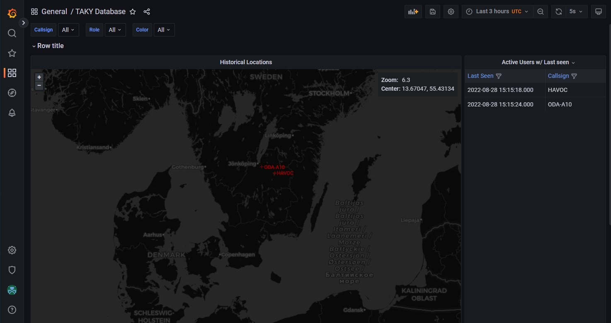

# taky-lookingglass
A time series project for Taky in order to have a centralilzed stored CoT Database to search through

## Project
https://github.com/Securitybits-io/taky-lookingglass

## Docker Images
https://hub.docker.com/r/securitybits/taky-lookingglass

## Tags
`latest` - is built on every code push

## Use
Set the environment variables according to your setup, it is somewhat aligned to be used with the same variables as skadakar\taky-docker
then download the docker-compose.yml from Project repo and adjust the volumes to match your environment.

run `docker-compose up -d` to start the environment.

Lookingglass uses the internal docker network to push and route CoTs, but can be adjusted by setting the `MYSQL_HOST` to a remote database.
Or the MariaDB can be exposed to the public network in order to access the database.

LookingGlass _should_ be able to connect to any TAKServer as it relies on RAW CoTs, but only have been tested with TAKY.

#### Example dashboard

## Supported env variables
| Variable            | Type   | Default      | Example Input |
|---------------------|--------|--------------|---------------|
| LOG_LEVEL           | STRING | INFO         | INFO, DEBUG   |
| IP                  | STRING | N/A          | example.com   |
| PORT                | INT    | 8089         | 8089          |
| CERT_PASS           | STRING | atakatak     | atakatak      |
| MYSQL_HOST          | STRING | taky-db      | taky-db       |
| MYSQL_ROOT_PASSWORD | STRING | N/A          | toor          |
| MYSQL_USER          | STRING | lookingglass | user          |
| MYSQL_PASSWORD      | STRING | sqlpass      | Pa55w0rd!     |
| GF_ADMIN_USER       | STRING | taky         | taky          |
| GF_ADMIN_PASSWORD   | STRING | lamepassword | Gr4fan4       |
| GF_SERVER_DOMAIN    | STRING | example.com  | example.com   |

### TODO
- [ ] Create a CoT Whitelist to have user input filter the queue
- [x] Format and store the COTs in a MariaDB Docker
- [x] Create a FIFO Queue for the ingest COTs to handle spikes of data
- [x] Create a thread in order to Ingest COTs
- [x] Create a Thread for outgoing CoTs
- [ ] Create environment variables
    - [ ] for whitelist of CoT types
    - [ ] if Color rewrite
    - [ ] Server Name (NATO/OPFOR/REDFOR), that will be ingested into the database
    - [x] SQL Connection Details
    - [x] TAKY server connection details
    - [x] grafana SQL user and password for reading the database
- [x] Grafana
    - [x] Create a dashboard
    - [x] Configure provisioning in grafana
- [x] SQL
    - [x] Connect function
    - [x] Create TAKYCot Database
    - [x] Create grafana user with password with read only
- [x] Create a global working docker-compose.yml
- [x] Clean up code
- [ ] Create a README and Documentation

### Known Bugs
- If the lookingglass container start before anything, it will fail to connect, a simple restart of the image is enough.

## Help Docs
- https://superfastpython.com/thread-queue/